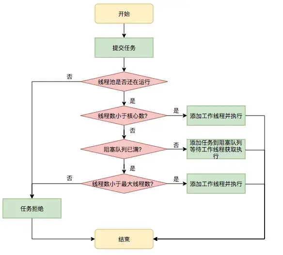

## 一、线程池怎么使用？

线程池的核心作用是复用线程、控制并发数量，避免频繁创建和销毁线程带来的开销。

### 1. 使用 `Executors` 创建线程池

`Executors` 提供了快速创建线程池的工厂方法，例如 `newFixedThreadPool()`、`newCachedThreadPool()` 和 `newSingleThreadExecutor()`，适合简单场景。

但在复杂业务中需要注意：`newCachedThreadPool()` 可能创建大量线程，`newFixedThreadPool()` 默认使用无界队列，`newScheduledThreadPool()` 也可能积压大量延迟任务。因此，生产环境通常更推荐手动配置 `ThreadPoolExecutor`，明确控制线程数量、队列容量和拒绝策略。

### 2. 手动创建 `ThreadPoolExecutor`

`ThreadPoolExecutor` 的构造方法需要配置 7 个核心参数：

1. `corePoolSize`：核心线程数，线程池长期保持的线程数量。
2. `maximumPoolSize`：最大线程数，线程池最多创建的线程数量。
3. `keepAliveTime`：非核心线程的空闲存活时间。
4. `unit`：存活时间的单位。
5. `workQueue`：任务队列，保存暂时无法执行的任务。
6. `threadFactory`：线程创建工厂，用于设置线程名称等属性。
7. `handler`：拒绝策略，队列和线程数都达到上限时处理新任务的方式。

```java
import java.util.concurrent.ArrayBlockingQueue;
import java.util.concurrent.Executors;
import java.util.concurrent.ThreadPoolExecutor;
import java.util.concurrent.TimeUnit;

public class ThreadPoolDemo {
    public static void main(String[] args) {
        // IO 密集型任务可以适当增加线程数，但具体值需要结合实际压测调整
        int corePoolSize = Runtime.getRuntime().availableProcessors() * 2;

        ThreadPoolExecutor threadPool = new ThreadPoolExecutor(
                corePoolSize,
                corePoolSize * 2,
                60L,
                TimeUnit.SECONDS,
                new ArrayBlockingQueue<>(100),
                Executors.defaultThreadFactory(),
                new ThreadPoolExecutor.AbortPolicy()
        );

        threadPool.execute(() -> {
            System.out.println("任务执行线程："
                    + Thread.currentThread().getName());
        });

        // 所有任务提交完成后关闭线程池
        threadPool.shutdown();
    }
}
```

线程数不能简单固定为 CPU 核数的几倍：CPU 密集型任务通常不需要太多线程，IO 密集型任务可以适当增加线程数，最终应结合任务耗时、等待比例和压测结果调整。

### 3. 拒绝策略

当线程池和任务队列都达到容量上限时，会执行拒绝策略：

- `AbortPolicy`：默认策略，直接抛出异常。
- `CallerRunsPolicy`：由提交任务的线程执行任务，起到一定的缓冲作用。
- `DiscardPolicy`：直接丢弃新任务，不抛出异常。
- `DiscardOldestPolicy`：丢弃队列中最旧的任务，再尝试提交新任务。

具体选择要看业务是否允许丢失任务。核心任务通常不能直接丢弃，需要记录失败、降级处理或重新入队。

### 4. `execute()` 和 `submit()` 的区别

- `execute()`：提交 `Runnable` 任务，没有返回值；任务执行过程中的异常通常会直接交给线程的异常处理机制。
- `submit()`：可以提交 `Runnable` 或 `Callable`，返回 `Future`；任务异常会被封装，通常需要调用 `Future.get()` 才能发现。

```java
import java.util.concurrent.ExecutionException;
import java.util.concurrent.Future;

Future<?> future = threadPool.submit(() -> {
    int result = 1 / 0;
});

try {
    future.get();
} catch (InterruptedException e) {
    Thread.currentThread().interrupt();
} catch (ExecutionException e) {
    System.out.println("任务执行异常：" + e.getCause());
}
```

### 5. 线程池使用原则

- 线程池使用完必须关闭，避免线程长期存活导致程序无法正常退出。
- 任务队列要设置合理容量，避免无界队列造成内存持续增长。
- 线程数要根据任务类型配置：CPU 密集型任务不宜创建过多线程，IO 密集型任务可以适当增加。
- 建议使用有意义的线程名称，便于日志分析和问题排查。
- 需要监控活跃线程数、队列长度、任务完成数和拒绝次数，及时发现线程池过载。

## 二、介绍一下线程池的工作原理

线程池通过复用线程，减少频繁创建和销毁线程带来的性能开销。



线程池包含核心线程数、最大线程数和任务等待队列。在运行状态下，提交任务时按以下顺序处理：

1. 当前线程数小于核心线程数：创建新线程执行任务。
2. 当前线程数已达到核心线程数：尝试将任务加入队列，等待线程取出执行。
3. 队列已满且当前线程数小于最大线程数：创建非核心线程执行任务。
4. 队列已满且线程数已达到最大线程数：执行配置的拒绝策略。

```text
提交任务
├─ 线程数小于核心线程数 → 创建线程执行
└─ 线程数已达到核心线程数 → 尝试入队
   ├─ 入队成功 → 等待执行
   └─ 队列已满
      ├─ 线程数小于最大线程数 → 创建非核心线程执行
      └─ 线程数已达到最大线程数 → 执行拒绝策略
```

线程执行完任务后，会继续从队列中获取任务，实现线程复用。超过核心线程数的空闲线程，默认在超过 `keepAliveTime` 后回收。

## 三、有线程池参数设置的经验吗？

核心线程数可以先按任务类型估算，再通过压测调整：

- CPU 密集型：通常从 CPU 核数或 CPU 核数 + 1 开始，避免过多线程竞争 CPU。
- IO 密集型：可以从 CPU 核数 × 2 开始；等待时间越长，可能需要更多线程，但要受下游连接数和处理能力限制。

以下配置假设有 8 核 CPU，参数仅作为初始参考。代码中的类型均来自 `java.util.concurrent` 包。

### 1. 电商突发流量：优先快速响应

```java
ThreadPoolExecutor pool = new ThreadPoolExecutor(
        16, 32,
        10L, TimeUnit.SECONDS,
        new SynchronousQueue<>(),
        new ThreadPoolExecutor.AbortPolicy()
);
```

`SynchronousQueue` 不缓存任务：没有空闲线程接收时，尝试扩容到最大线程数；仍无法处理则快速拒绝。业务层捕获拒绝异常，返回繁忙提示，并结合限流、降级处理。

### 2. 后台数据处理：允许一定排队

```java
ThreadPoolExecutor pool = new ThreadPoolExecutor(
        8, 8,
        0L, TimeUnit.SECONDS,
        new ArrayBlockingQueue<>(1000),
        new ThreadPoolExecutor.CallerRunsPolicy()
);
```

固定线程数控制资源使用，有界队列缓冲任务。队列满时，`CallerRunsPolicy` 让提交任务的线程执行，减慢提交速度；需要确认该线程可以承受阻塞。这里默认不启用核心线程超时，因此核心线程不会因空闲被回收。

### 3. 微服务 HTTP 调用：关注下游容量

```java
ThreadPoolExecutor pool = new ThreadPoolExecutor(
        16, 64,
        60L, TimeUnit.SECONDS,
        new LinkedBlockingQueue<>(200),
        new ThreadPoolExecutor.AbortPolicy()
);
```

线程数需要结合下游响应时间、连接池容量和并发上限调整。任务先进入队列，队列满后才扩容；下游变慢时，应配合超时、限流和熔断，避免不断增加线程放大压力。

也可以自定义拒绝策略，将可重试任务写入持久化队列后异步重试，但需要限制重试次数并保证幂等；`CustomRetryPolicy` 并不是 JDK 自带的类。

### 4. 调整时关注什么？

- 队列容量：结合任务到达速度和允许的等待时间设置，过大会增加延迟和内存占用。
- 最大线程数：受 CPU、内存以及下游承载能力约束。
- 监控指标：活跃线程数、队列长度、任务耗时和拒绝次数，根据压测及线上表现调整。

队列使用率达到阈值时可以触发告警，但是否扩容还要看瓶颈位置；例如下游已经过载，增加线程可能使问题更严重。

参考：[ThreadPoolExecutor 官方文档](https://docs.oracle.com/en/java/javase/26/docs/api/java.base/java/util/concurrent/ThreadPoolExecutor.html)。

## 四、线程池和三个线程同时并发比有什么优势？

线程池的优势主要在于统一管理线程和任务，适合持续处理大量任务的场景：

- **线程复用**：执行完任务后继续处理后续任务，减少频繁创建和销毁线程的开销。
- **控制并发**：通过线程数上限和有界队列限制资源使用，避免大量任务导致线程无限增长。
- **任务管理**：提供任务排队、拒绝策略、执行结果获取和统一关闭等机制，减少手动管理的代码。
- **监控和调整**：可以观察活跃线程数、队列长度等指标，并根据负载调整配置。

三个固定线程也可以复用，但任务分配、排队和停止等逻辑需要自行管理。如果只有三个一次性任务，直接创建线程也可以；线程池并不必然更快。线程池大小同样设为 3 时，并发执行能力通常与三个固定线程相近，优势主要是管理更方便。

## 五、线程池用了哪些设计模式？

- **工厂模式**：`Executors` 的静态工厂方法封装线程池的创建和参数配置；`ThreadFactory` 负责创建工作线程。
- **生产者—消费者模式**：提交任务的线程是生产者，工作线程是消费者，通过任务队列衔接，解耦任务提交和执行。部分任务也会直接交给新建线程执行。
- **策略模式**：通过 `RejectedExecutionHandler` 配置不同的拒绝策略，例如 `AbortPolicy`、`CallerRunsPolicy`，也可以自行实现。
- **模板方法模式**：`ThreadPoolExecutor` 定义工作线程执行任务的流程，提供 `beforeExecute()`、`afterExecute()` 和 `terminated()` 等钩子，允许子类扩展。

线程池还体现了**池化和资源复用思想**：同一个工作线程可以先后执行多个任务。有些资料将其归为享元模式，但严格来说，线程池的资源复用与享元模式中共享细粒度对象的设计并不完全相同。

## 六、`shutdown()` 和 `shutdownNow()` 有什么作用？

两者都用于关闭线程池，调用后不再接受新任务，主要区别如下：

| 对比项 | `shutdown()` | `shutdownNow()` |
| --- | --- | --- |
| 线程池状态 | 进入 `SHUTDOWN` | 进入 `STOP` |
| 正在执行的任务 | 继续执行 | 尝试通过中断停止 |
| 队列中的任务 | 继续处理 | 不再执行，并返回尚未开始的任务列表 |
| 是否等待线程池终止 | 不等待 | 不等待 |

`shutdown()` 属于有序关闭，会中断空闲工作线程，使其检查关闭状态；已提交的任务仍会继续执行，全部处理完后线程池才终止。新任务会交给拒绝策略处理，默认策略抛出 `RejectedExecutionException`。

`shutdownNow()` 通过 `interrupt()` 请求正在执行的任务停止，并不强制杀死线程。任务需要响应可中断的阻塞操作，或主动检查中断标志；如果忽略中断，就可能继续运行。

通常先调用 `shutdown()`，再用 `awaitTermination()` 等待一段时间；若仍未结束，再调用 `shutdownNow()`。可以通过 `isTerminated()` 判断线程池是否已经完全终止。
