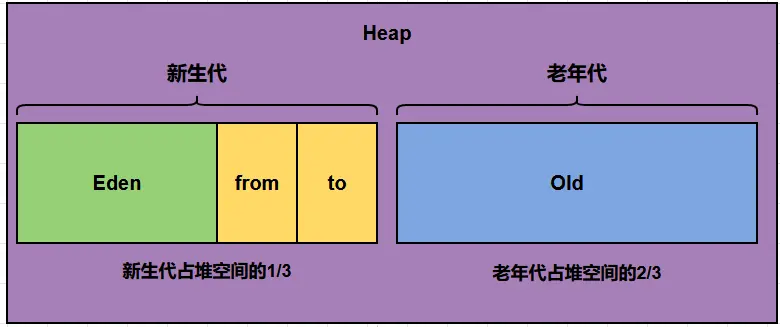

## 一、JVM 的内存模型介绍一下

这里指 JVM 的**运行时数据区**，与并发编程中规定可见性、有序性等规则的 Java 内存模型（JMM）不同。

JVM 规范将运行时数据区分为程序计数器、Java 虚拟机栈、本地方法栈、堆和方法区五部分。程序计数器和两个栈是线程私有的，堆和方法区由线程共享。

### 1. 程序计数器

记录当前线程正在执行的 JVM 指令地址，便于线程切换后恢复执行。执行 Native 方法时，其值为未定义。它是唯一没有在 JVM 规范中规定 `OutOfMemoryError` 的运行时数据区。

### 2. Java 虚拟机栈

每个线程都有独立的虚拟机栈。方法调用时创建栈帧，保存局部变量表、操作数栈、动态链接和方法返回信息；方法结束后栈帧出栈。

调用深度超过栈允许的范围时，会抛出 `StackOverflowError`；栈创建或扩展时无法分配内存，可能抛出 `OutOfMemoryError`。

### 3. 本地方法栈

为 Native 方法执行提供支持。在 HotSpot 中，本地方法栈与 Java 虚拟机栈合并实现。也可能出现 `StackOverflowError` 和 `OutOfMemoryError`。

### 4. Java 堆

用于分配对象实例和数组，是垃圾回收主要管理的区域。无法分配足够内存时，会抛出 `OutOfMemoryError`。

常见分代回收器会将堆划分为新生代和老年代，新生代再分为 Eden 和两个 Survivor 区；具体布局取决于垃圾回收器，并非 JVM 规范固定要求。

### 5. 方法区与元空间

方法区是规范中的逻辑区域，保存类结构、方法信息和运行时常量池等数据，内存不足时可能抛出 `OutOfMemoryError`。

JDK 8 起，HotSpot 移除永久代，使用本地内存中的**元空间**保存类元数据。因此，元空间是实现层面的概念，不能说 JVM 规范中的方法区被取消了。静态字段的值和字符串常量池位于 Java 堆中，不应笼统地说它们都存放在元空间。

### 6. 运行时常量池

属于方法区，保存类或接口的常量池在运行时的表示，包括字面量和符号引用等。它与保存驻留字符串的字符串常量池不是同一个概念。

### 7. 直接内存

不属于 JVM 规范定义的运行时数据区，是堆外内存。NIO 可以通过 `ByteBuffer.allocateDirect()` 使用直接内存，减少部分 IO 场景中的数据复制。分配受直接内存上限和可用本地内存限制，也可能出现 `OutOfMemoryError`。

参考：[JVM 规范：运行时数据区](https://docs.oracle.com/javase/specs/jvms/se8/html/jvms-2.html#jvms-2.5)、[JEP 122：移除永久代](https://openjdk.org/jeps/122)。

## 二、JVM 内存模型里的堆和栈有什么区别？

这里的栈主要指 Java 虚拟机栈。

| 对比项 | 栈 | 堆 |
| --- | --- | --- |
| 用途 | 保存方法调用的栈帧，包括局部变量表、操作数栈等 | 分配对象实例和数组 |
| 生命周期 | 栈随线程创建和销毁，栈帧随方法调用入栈、结束出栈 | 对象的存活由可达性等因素决定，由 GC 管理回收 |
| 线程共享 | 每个线程独立拥有 | 所有线程共享，但具体对象不一定被多个线程访问 |
| 空间配置 | 平台线程栈大小通常通过 `-Xss` 设置 | 通常通过 `-Xms`、`-Xmx` 设置初始和最大堆大小 |
| 常见异常 | 调用过深导致 `StackOverflowError`；内存分配失败可能导致 `OutOfMemoryError` | 内存不足导致 `OutOfMemoryError` |

栈帧按后进先出管理，分配和释放通常较简单；堆上的对象需要垃圾回收管理，但堆分配也有 TLAB 等优化，不能据此断言所有栈访问都比堆访问快。

局部变量可以保存对象引用，引用所指向的对象通常位于堆中。方法结束只会移除对应栈帧，不代表对象立即被回收；对象是否可回收取决于它能否从 GC Roots 到达，实际回收还要等待 GC。

## 三、栈中存的到底是指针还是对象？

栈帧中的局部变量表主要保存**基本类型的值和对象引用**。对象引用用于访问对象，具体表示由 JVM 实现决定，不一定就是对象的原始内存地址；对象实例和数组通常分配在堆中。

```java
MyObject obj = new MyObject();
```

这里 `obj` 是局部变量，保存对对象的引用；`new MyObject()` 创建的对象通常位于堆中。引用不是对象本身，引用变量消失也不意味着对象立即被回收。

引用大小不能仅凭“64 位系统”判断，还取决于 JVM 实现和压缩指针等配置。例如，HotSpot 在启用压缩普通对象指针时，堆中的对象引用字段通常占 4 字节，而不是固定为 8 字节。

## 四、堆分为哪几部分？

在常见的分代回收模型中，Java 堆分为**新生代和老年代**，具体布局取决于垃圾回收器。



- **新生代**：通常分为 Eden 和两个 Survivor 区（S0、S1）。大多数新对象先分配在 Eden；新生代 GC 后，存活对象会转移到 Survivor 或晋升到老年代。两个 Survivor 区交替承担 From 和 To 的角色。
- **老年代**：主要保存长期存活、从新生代晋升的对象；部分大对象也可能直接分配到老年代，具体取决于回收器及配置。

图中的新生代与老年代比例，以及 Eden、S0、S1 的 `8:1:1` 比例，是常见配置示意，不是所有 JVM 和回收器都固定使用的划分。

G1 将堆划分为多个大小相同的 Region，动态分配为 Eden、Survivor 和老年代。超过单个 Region 一半大小的对象称为 Humongous 对象，分配到一个或多个连续的 Humongous Region，在逻辑上属于老年代。

**元空间不属于 Java 堆**，它使用本地内存保存类元数据，也可能发生内存溢出。另外，Major GC 通常指老年代回收，Full GC 通常涉及整个堆；具体术语应结合回收器和 GC 日志理解，不能直接等同。

## 五、方法区中的方法是如何执行的？

方法区保存方法的相关信息和字节码，方法调用的执行上下文则由当前线程的虚拟机栈管理。一次普通 Java 方法调用主要包括：

1. **解析与确定目标方法**：将符号引用解析为直接引用；对于需要动态分派的调用，还要根据接收对象的实际类型确定目标方法。
2. **创建栈帧**：在当前线程的虚拟机栈中创建栈帧，保存参数、局部变量、操作数栈、动态链接和返回信息。
3. **执行方法**：解释器执行字节码，或执行 JIT 编译后的机器码，完成计算、对象操作及其他方法调用。
4. **返回与出栈**：正常结束时将返回值交给调用者并移除栈帧，恢复调用者执行；若异常未在当前方法中处理，则退出当前栈帧，向调用者传播异常。

## 六、String 保存在哪里？

`String` 对象通常位于堆中，内容不可变。字符串字面量和调用 `intern()` 后得到的规范化字符串可以通过字符串常量池共享。

在 HotSpot 中，JDK 6 及以前，驻留字符串存放在永久代；从 JDK 7 起移到 Java 堆。字符串常量池与类的运行时常量池不是同一个概念。

### `String s = new String("abc")` 对应哪些内存区域？

```java
String s = new String("abc");
```

- **字面量 `"abc"`**：使用字符串常量池中的规范化 String 实例；如果此前没有对应实例，需要创建并驻留。该实例在现代 HotSpot 中位于堆中。
- **`new String("abc")`**：创建一个新的 String 实例，与字面量对应的实例不是同一个对象，但内容相同。
- **变量 `s`**：如果是方法中的局部变量，其引用保存在栈帧的局部变量表中，指向新建的 String 实例。

通常所说的“创建两个对象”，是指字面量首次驻留时的 String 实例和 `new` 创建的 String 实例；如果字面量已驻留，就只需新建一个 String 实例。这种计数只针对 String 对象，不包含底层字符或字节数组，而且字面量的驻留可能早于这条语句执行。

## 七、引用类型有哪些？有什么区别？

这里指与垃圾回收相关的四种引用，强度依次为：**强引用 > 软引用 > 弱引用 > 虚引用**。

| 引用类型 | 表示方式 | 回收特点 | 常见用途 |
| --- | --- | --- | --- |
| 强引用 | 普通对象引用 | 对象仍能通过强引用从 GC Roots 到达时，不会被回收 | 正常持有和使用对象 |
| 软引用 | `SoftReference` | 仅软可达时，可能被回收；抛出内存不足异常前会清除软可达对象的软引用 | 内存敏感的缓存 |
| 弱引用 | `WeakReference` | GC 发现对象仅弱可达时，会清除弱引用，不要求内存不足 | 不阻止对象回收的关联关系 |
| 虚引用 | `PhantomReference` | 不阻止对象回收，`get()` 始终返回 `null`，通过引用队列接收通知 | 跟踪对象回收，辅助清理堆外资源 |

判断强引用是否阻止回收，要看对象是否仍然强可达，不能只看变量是否离开作用域或被置为 `null`。

虚引用通常与 `ReferenceQueue` 配合使用。引用入队后，需要由清理逻辑释放相关资源；虚引用本身不会自动释放堆外内存。软引用和弱引用也可以关联引用队列，以便处理引用失效后的清理工作。

## 八、如何理解内存泄漏和内存溢出？

**内存泄漏**：程序不再需要的对象仍被长期引用，GC 无法回收，导致内存持续被占用。堆外资源未正确释放也可能造成泄漏。

常见原因包括：

- 静态集合或缓存不断积累对象，没有清理或淘汰机制。
- 事件监听器未注销，导致对象被事件源持续持有。
- 长期存活的线程持有无用对象，或线程池中的 `ThreadLocal` 使用后未清理。
- 需要显式释放的本地资源未释放。

**内存溢出**：程序申请内存时，无法获得足够的空间，抛出 `OutOfMemoryError`。不只可能发生在堆中，也可能涉及元空间、直接内存或本地线程创建。

常见原因包括数据量过大、无界队列或缓存持续增长、内存配置过小，以及线程数量过多。`unable to create native thread` 还可能与操作系统线程数限制有关，不一定只是内存不足。

两者的关系是：**内存泄漏可能最终导致内存溢出，但内存溢出不一定由泄漏引起**。深度递归通常导致 `StackOverflowError`，与 `OutOfMemoryError` 是不同的错误。

处理时先根据异常信息和内存监控确定出问题的区域；堆问题可以分析堆转储和对象引用链。再针对原因清理无用引用、限制缓存和队列容量、控制线程数，或调整合理的内存配置。

## 九、JVM 有哪些常见的内存溢出情况？如何解决？

### 1. 堆内存溢出

- **异常**：`OutOfMemoryError: Java heap space`。
- **原因**：对象或数据量过大、缓存和队列无界增长、内存泄漏，或堆上限过小。
- **解决**：通过堆转储分析大对象和引用链，清理无用引用；为缓存和队列设置容量限制，大批量数据分批处理。确认内存需求合理后，再调整 `-Xmx`。

可以配置 `-XX:+HeapDumpOnOutOfMemoryError` 和 `-XX:HeapDumpPath`，在发生 OOM 时保存堆转储。

### 2. 栈溢出与线程创建失败

- **异常**：深度递归通常导致 `StackOverflowError`，它不是 OOM；创建本地线程失败可能出现 `OutOfMemoryError: unable to create native thread`。
- **原因**：递归没有终止条件或调用层次过深；线程过多、本地内存不足或达到操作系统限制。
- **解决**：修复递归终止条件，必要时改为迭代；合理调用深度确实需要更大栈时，可调整 `-Xss`。线程创建失败则应排查线程泄漏、限制线程池大小，并检查本地内存及系统线程数限制。

增大 `-Xss` 会增加每个平台线程的内存开销，不能用它解决线程过多的问题。

### 3. 元空间溢出

- **异常**：`OutOfMemoryError: Metaspace`。
- **原因**：加载或动态生成过多类、类加载器泄漏，或元空间上限过小。
- **解决**：检查已加载类数量和类加载器引用，减少重复生成类，清理阻止类加载器回收的引用；若属于正常需求，可调整 `-XX:MaxMetaspaceSize`，同时确认本地内存充足。

### 4. 直接内存溢出

- **异常**：直接缓冲区分配失败时，常见信息包含 `Direct buffer memory`。
- **原因**：直接缓冲区分配过多、仍被引用无法清理、框架缓冲区未按要求释放，或直接内存上限过小。
- **解决**：限制缓冲区数量和大小，复用缓冲区，清理无用引用；使用 Netty 等框架时正确释放引用计数资源。必要时调整 `-XX:MaxDirectMemorySize`，并检查进程或容器的可用内存。

排查时先根据异常定位内存区域，再分析是否泄漏或正常容量不足，避免只增大内存而让问题继续累积。

## 十、有哪些具体的内存泄漏或内存溢出例子？如何解决？

### 1. 静态集合长期持有对象

```java
private static final List<byte[]> CACHE = new ArrayList<>();

public static void handleRequest() {
    CACHE.add(new byte[1024 * 1024]);
}
```

每次请求都向静态集合中添加数据，如果这些数据已经无用却一直不清理，就会造成泄漏，持续增长可能最终导致堆 OOM。问题在于长期持有无用对象，而不是使用 `static` 本身。

**解决**：及时移除无用数据，为缓存设置容量、过期时间或淘汰策略，避免无限增长。

### 2. 资源未关闭

文件流、数据库连接等未关闭，可能造成文件描述符耗尽、连接池耗尽或本地资源泄漏，不一定表现为堆 OOM。

**解决**：优先使用 `try-with-resources`，在正常或异常退出时关闭实现了 `AutoCloseable` 的资源。

```java
try (InputStream in = Files.newInputStream(path)) {
    // 使用输入流
}
```

对于不支持自动关闭的资源，在 `finally` 中清理，并妥善处理清理过程中的异常。

### 3. 线程池中的 ThreadLocal 未清理

每个线程的 `ThreadLocalMap` 保存当前线程的值：Entry 的 key 是对 `ThreadLocal` 实例的弱引用，value 是强引用。线程池线程长期存活，如果使用后不清理，value 可能长期占用内存，还可能被后续任务误用。

当 key 被 GC 清除后，value 仍可能被 Entry 持有。后续部分 `get()`、`set()`、`remove()` 操作会清理失效 Entry，但不能依赖这些操作及时发生。

**解决**：在设置值的当前线程中，用 `finally` 调用 `remove()`。

```java
try {
    threadLocal.set(System.nanoTime());
    // 处理当前任务
} finally {
    threadLocal.remove();
}
```

`set(null)` 会将当前 Entry 的 value 设为 `null`，解除它对原对象的引用，但不会删除 Entry；`remove()` 则移除当前线程对应的 Entry，后续 `get()` 可以重新执行初始化逻辑，因此清理时应使用 `remove()`。
