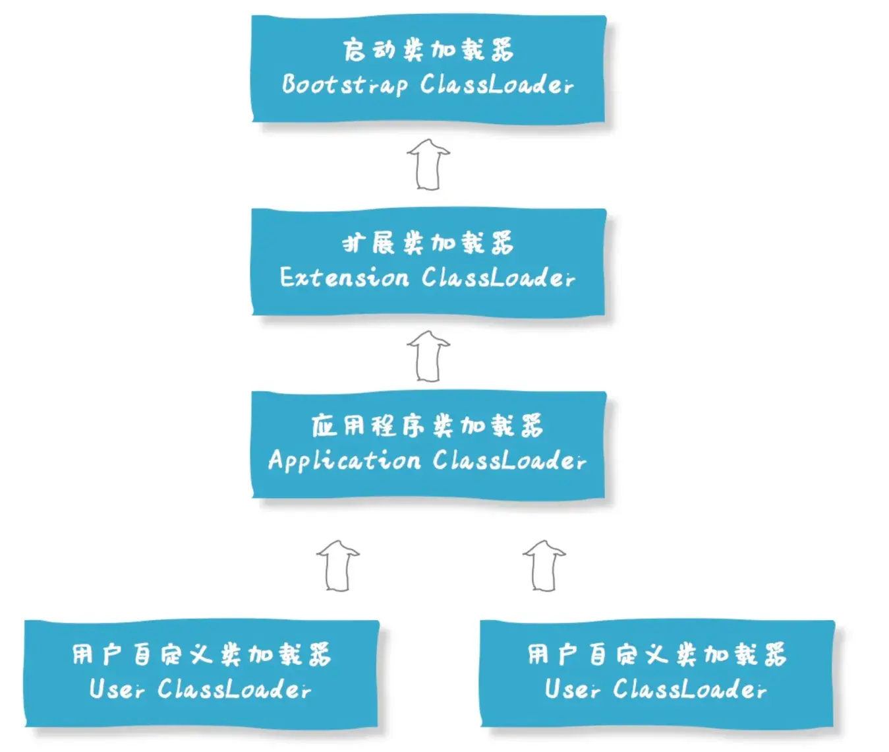

## 一、创建对象的过程？

以普通 Java 对象的 `new` 创建过程为例，主要包括以下步骤：

1. **类加载检查**：解析目标类的符号引用，确保类已完成必要的加载、链接和初始化。类初始化执行的是 `<clinit>`，与对象的构造方法不同。
2. **分配内存**：根据对象所需大小，通常在 Java 堆中分配空间。HotSpot 可通过指针碰撞、空闲列表等方式分配，并利用 TLAB 等机制优化并发分配。
3. **初始化零值**：将实例字段设置为类型对应的默认值，例如整数为 `0`、布尔值为 `false`、引用为 `null`。这不等于执行代码中显式声明的初始值。
4. **设置对象头**：记录类元数据关联、运行时状态等信息。对象头的具体布局取决于 JVM 实现和配置，哈希码等信息不一定在此时就计算出来。
5. **执行构造方法 `<init>`**：完成父类构造、实例字段显式初始化、实例初始化块和构造方法体的执行，将对象初始化为程序需要的状态。

类初始化通常对每个类执行一次，而实例初始化会在每次正常构造新对象时执行。

## 二、对象的生命周期

对象的生命周期可以概括为创建、使用和回收三个阶段：

- **创建**：分配内存、设置默认值和对象头，再执行构造方法完成初始化。
- **使用**：通过引用访问对象的字段和方法。对象能否继续存活，主要取决于它是否仍可从 GC Roots 到达，以及相关引用的类型。
- **回收**：对象满足回收条件后，由垃圾回收器在后续 GC 中回收所占内存，不保证立即发生。

引用变量离开作用域或被设为 `null`，不代表对象一定可回收，因为其他位置可能仍持有它。文件、连接等资源也不能只等待 GC，应在使用结束后及时关闭。

## 三、类加载器有哪些？

- **启动类加载器（Bootstrap Class Loader）**：负责加载核心类，如 `java.lang.String`。JDK 8 及以前，核心类库主要来自 `rt.jar`；JDK 9 起采用模块化运行时映像。获取它加载的类的 `getClassLoader()` 时，返回 `null`。
- **平台类加载器（Platform Class Loader）**：JDK 9 起负责加载部分平台类，可通过 `ClassLoader.getPlatformClassLoader()` 获取。JDK 8 及以前对应的是扩展类加载器，加载 `jre/lib/ext` 或 `java.ext.dirs` 指定位置的类；这些扩展机制在 JDK 9 被移除。
- **应用程序类加载器（Application Class Loader）**：默认负责加载应用类路径及分配给它的应用模块中的类，可通过 `ClassLoader.getSystemClassLoader()` 获取。其父加载器通常是平台类加载器，JDK 8 中则是扩展类加载器。
- **自定义类加载器**：开发者继承 `ClassLoader` 等类，实现从网络、加密文件等来源加载类，也可用于插件隔离。

默认的双亲委派过程是：先检查类是否已加载，再委派父加载器尝试加载；父加载器找不到时，当前加载器才尝试自行加载。父子关系是委派关系，不是类继承关系；自定义加载器可以改变委派规则，模块化场景也有额外的委派逻辑。

参考：[ClassLoader 官方文档](https://docs.oracle.com/en/java/javase/26/docs/api/java.base/java/lang/ClassLoader.html)。

## 四、Java 中双亲委派是什么？有什么用？

双亲委派是默认的类加载策略：**先让父加载器尝试加载，父加载器找不到时，再由当前加载器加载**。“双亲”指父加载器的委派关系，不是 Java 类的继承关系。

加载流程通常是：

1. 检查当前加载器是否已经加载过该类，已加载则直接返回。
2. 委派父加载器，逐级尝试，直到启动类加载器。
3. 父加载器找不到目标类时，当前加载器再调用 `findClass()` 尝试加载。

主要作用：

- **共享类、减少重复加载**：不同子加载器可以使用同一个父加载器定义的类。
- **保护核心类**：优先使用 JDK 提供的类，避免应用中同名类替换核心类。例如加载 `java.lang.String` 时，会优先得到启动类加载器定义的 String。

但双亲委派不保证所有同名类在整个 JVM 中只有一份。**类的身份由二进制类名和定义它的类加载器共同决定**，不同加载器独立定义的同名类仍是不同的类型。自定义加载器可以改变委派规则，因此双亲委派也不是完整的安全隔离机制。

## 五、讲一下类的加载和双亲委派原则

类进入可使用状态主要经历**加载 → 链接 → 初始化**，链接又分为验证、准备和解析。

### 1. 加载（Loading）

根据类名获取字节码，将其转换为 JVM 内部的类结构，并创建对应的 `Class` 对象。字节码可以来自 class 文件、JAR 包、网络等来源，自定义类加载器可以参与这一过程。

### 2. 链接（Linking）

- **验证**：检查 class 文件格式、字节码和类型关系等是否符合要求，避免不合法的代码破坏 JVM。不同验证失败可能对应不同错误，如 `ClassFormatError`、`VerifyError`。
- **准备**：为静态字段分配存储空间，并设置默认值，例如整数为 `0`、引用为 `null`。实例字段不在此阶段处理。
- **解析**：将运行时常量池中的符号引用解析为直接引用。解析可以按需进行，不一定在类初始化前一次性完成。

具有 `ConstantValue` 属性的静态字段，例如编译期常量，会在执行 `<clinit>` 前按该属性赋值；不要把它与普通静态字段在初始化阶段的显式赋值混淆。

### 3. 初始化（Initialization）

执行类初始化方法 `<clinit>`，完成普通静态字段的显式赋值和静态初始化块，按源码顺序执行。初始化类时，会先初始化其父类；接口的初始化规则有所不同，不会简单地初始化所有父接口。

加载类不代表立即初始化类，初始化通常由首次主动使用触发，例如创建实例、调用静态方法等。

### 4. 双亲委派原则

类加载器通常先检查是否已加载，再委派父加载器；父加载器找不到时，才尝试自行加载。这样可以共享父加载器定义的类，并优先使用核心类。具体流程与作用见上一题。
