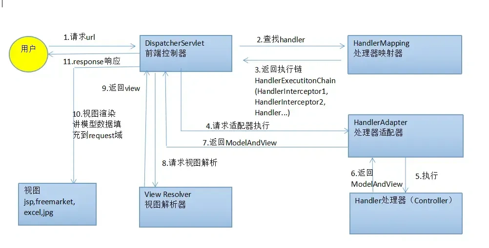

## 一、介绍一下 MVC 分层

MVC 是 **Model（模型）、View（视图）、Controller（控制器）** 的缩写，通过分离数据与业务处理、界面展示和请求协调，减少耦合，便于维护。

- **Model**：表示业务数据及相关处理逻辑。在 Spring MVC 中，`Model` 通常用于向视图传递数据，业务逻辑一般由 Service 承担，数据访问由 DAO 或 Repository 承担。
- **View**：负责展示数据，例如通过 Thymeleaf、JSP 等渲染页面。
- **Controller**：接收请求、绑定和校验参数，调用业务服务，再组织模型数据和选择视图，或直接返回响应数据。

典型页面请求流程：

1. 用户通过页面、表单等向服务端发起请求。
2. Controller 接收请求，调用 Service 等组件进行处理。
3. Controller 将处理结果放入模型，并指定视图。
4. 视图渲染模型数据，生成页面并返回客户端。

MVC 与 Controller—Service—Repository 三层架构不是同一套划分，可以配合使用。在前后端分离场景中，Controller 通常直接返回 JSON，由前端负责界面渲染。

## 二、Spring MVC 的工作流程

1. 请求到达前端控制器 `DispatcherServlet`。
2. `DispatcherServlet` 通过 `HandlerMapping` 查找处理器，得到包含处理器及拦截器的 `HandlerExecutionChain`。
3. 查找支持该处理器的 `HandlerAdapter`，在拦截器允许执行后，由适配器调用处理器；相关组件完成参数解析、类型转换和校验。
4. Controller 执行业务调用并返回结果，由适配器处理返回值。
5. 对于视图响应，组织 `ModelAndView`，通过 `ViewResolver` 将视图名称解析为具体 `View`。
6. `View` 使用模型数据渲染页面，输出响应，最后完成拦截器的收尾回调。

使用 `@ResponseBody` 或 `@RestController` 返回响应数据时，通常由 `HttpMessageConverter` 将结果写入响应，不走视图解析和页面渲染流程。Controller 也不必显式返回 `ModelAndView`，可以返回视图名称等类型。

## 三、HandlerMapping 和 HandlerAdapter 有什么作用？

| 组件 | 职责 | 常见实现 |
| --- | --- | --- |
| `HandlerMapping` | 根据请求查找处理器，返回包含处理器和拦截器的 `HandlerExecutionChain` | `RequestMappingHandlerMapping`、`BeanNameUrlHandlerMapping` |
| `HandlerAdapter` | 适配不同类型的处理器，执行调用并处理结果 | `RequestMappingHandlerAdapter`、`SimpleControllerHandlerAdapter`、`HttpRequestHandlerAdapter` |

`RequestMappingHandlerMapping` 根据路径、HTTP 方法、请求参数和请求头等条件，匹配 `@RequestMapping` 等注解对应的方法，返回的处理器通常是 `HandlerMethod`，不只是 Controller 对象。

`DispatcherServlet` 找到处理器后，通过适配器的 `supports()` 选择合适的 `HandlerAdapter`。对于注解控制器，`RequestMappingHandlerAdapter` 协调参数解析、数据绑定、校验、方法调用和返回值处理。

两者配合的流程是：**HandlerMapping 找到谁来处理 → DispatcherServlet 选择适配器 → HandlerAdapter 调用处理器并处理返回值**。后续根据结果渲染视图，或直接写入响应数据，不一定生成 `ModelAndView`。
